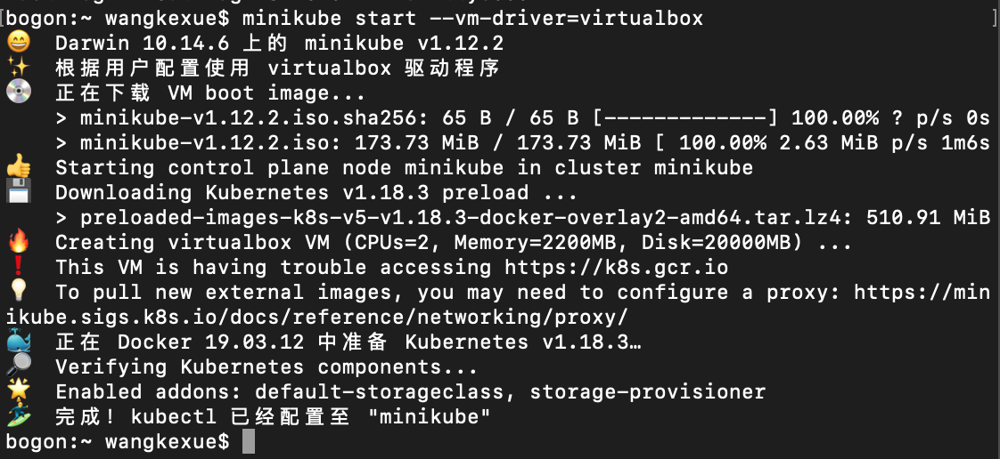

## 安装Minikube环境 - Mac

https://kubernetes.io/docs/tasks/tools/install-minikube/

Step 1: 检查环境是否开了虚拟

```
sysctl -a | grep -E --color 'machdep.cpu.features|VMX'
```

Step 2: 下载 kubectl
https://kubernetes.io/docs/tasks/tools/install-kubectl/
```
curl -LO "https://storage.googleapis.com/kubernetes-release/release/$(curl -s https://storage.googleapis.com/kubernetes-release/release/stable.txt)/bin/darwin/amd64/kubectl"

或者手工下载 https://storage.googleapis.com/kubernetes-release/release/v1.18.6/bin/darwin/amd64/kubectl
chmod +x kubectl 
sudo mv kubectl /usr/local/bin/kubectl
```

Step 3: VisualBox 下载安装
```
VirtualBox-6.0.14-133895-OSX.dmg
```

Step 4: Docker 安装下载


Step 5: Minikube 安装

```
brew install minikube

可以选择下载
https://storage.googleapis.com/minikube/releases/latest/minikube-darwin-amd64
mv minikube-darwin-amd64 minikube
chmod +x minikube 
sudo mv minikube /usr/local/bin/minikube
```

Step 6: 启动 Minikube

```
minikube start --vm-driver=virtualbox
```


Step 7. Minikube 用本地的image 

https://stackoverflow.com/questions/42564058/how-to-use-local-docker-images-with-minikube
